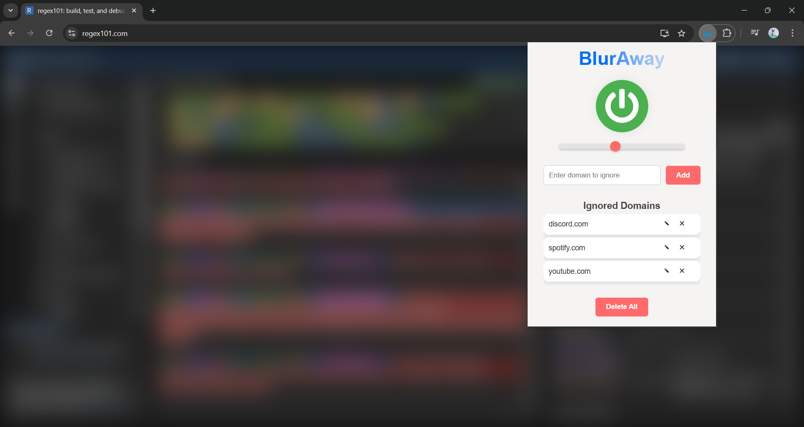

# BlurAway

> **Focus on what matters - Blur the rest!**

BlurAway is a Chrome extension designed to keep your browsing distraction-free. By applying a customizable blur effect on non-active windows whenever your cursor leaves the screen, BlurAway helps you maintain focus on the active tab and protect your privacy. It also allows you to ignore specific domains, so you’re in control of when and where the blur effect applies.

## Features

- **Tab Blur Effect:** Automatically blurs content when your cursor exits the active tab area, enhancing focus and privacy.
- **Customizable Blur Intensity:** Adjust the blur intensity to suit your preference with a slider.
- **Domain Ignoring:** Choose specific domains where the blur effect should not apply.
- **Manage Ignored Domains:** Add, edit, or delete ignored domains to fully control the blur experience.



## Getting Started

1. **[Install](#installation) BlurAway**
2. **Set up your preferences** via the popup interface.

## Usage

1. Click on the BlurAway icon to open the popup.
2. Toggle the blur effect on or off.
3. Adjust the blur level using the slider.
4. Add domains to the "Ignored Domains" list to prevent the blur effect on specific sites.

## Installation

1. Clone this repository:
   ```bash
   git clone https://github.com/lemm-e/BlurAway.git
   ```
2. Go to **chrome://extensions** in Chrome.
3. Enable **Developer mode** and click **Load unpacked**.
4. Select the cloned `BlurAway` directory to load the extension.

## Contributing

Contributions to BlurAway are welcome. Feel free to submit issues or pull requests.
